# SafetyOne - 부정사용거래를 줄이기 위한 통합관리 서비스

# 1. 프로젝트 소개

### 1-1. 기획배경
• 신용카드 부정사용 5년간 11.6만건 발생.<br/>
• 부정거래금액에 대한 보상은 곧 카드사의 손실로 이어짐.<br/>
• 부정거래가 일어날 경우의 수를 줄여 카드사의 손실을 줄인다면 장기적으로 이는 카드사의 이익으로 이어질 것으로 기대함.<br/>

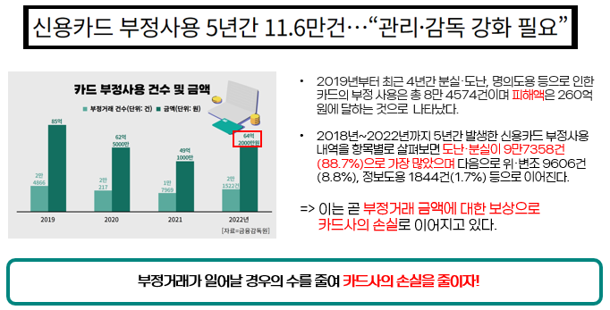 <br/>

### 1-2. 목표
#### 부정사용거래를 줄이기 위한 사전, 사후 통합 관리 서비스
• 안심서비스 (사전) : 안심서비스로 본인만의 Rule을 설정하여 Rule에 해당하는 거래는 사전에 차단되어 부정거래 가능성을 사전에 예방. <br/>
• 이상소비알림서비스 (사후) : 이상소비 알림 서비스로 평소의 거래패턴과 다를 경우 고객에게 실시간으로 알림 메시지를 전송하여 부정사용의 연속적인 발생을 방지. <br/>

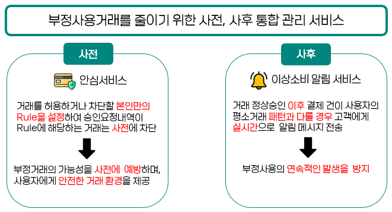 <br/>


### 1-3. 개발환경

```
OS : Window 10
Framework : Spring Boot, FastAPI
Server : tomcat9
Tool : Intellij, VSCode, Sql Developer, Github
DBMS : Oracle DBMS
```

### 1-4. 수행기간

개발기간: 2022.09.01 - 2022.10.20 <br/>

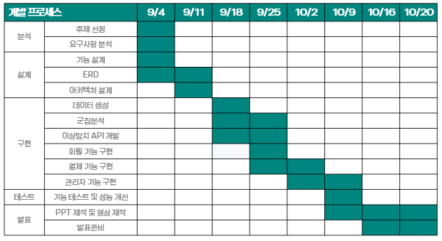 <br/>


# 2. 주요기능

### 2-1. 사용자

• 안심서비스 (SafetyOne 사전 서비스) :<br/>
  사용자는 개인별로 거래를 허용하거나 차단할 본인만의 Rule을 설정.<br/>
  승인 요청이 들어오는 거래가 설정된 Rule과 일치할 경우 거래는 미승인.<br/>
  서비스 일시정지 : 안심 Rule 차단 항목 중 일정기간동안 거래를 허용하도록 서비스 일시정지 <br/><br/>
  
• 이상소비알림서비스 (SafetyOne 사후 서비스) :<br/>
  사용자가 서비스를 신청하면, 최근 6개월 동안의 카드 거래 내역을 학습하여 가중치를 저장.</br>
  사용자가 카드 결제하여 정상 승인이 난 이후 해당 결제 내역이 평소 거래 패턴과 다를 경우, 실시간 알림 메시지 전송.</br><br/>
  
• 분실/도난 신고 : <br/>
  카드 분실신고 및 재발급 동시에 신청 가능.<br/><br/>
  
• 소비레포트 : <br/>
  사용자의 거래내역을 활용하여 이번달의 소비 변화와 3개월동안 카테고리별 사용금액과 결제빈도, 결제 시간 및 지역별 지출 금액 확인 가능. </br><br/>

• 결제 : <br/>
  안심서비스, 이상소비알림서비스 각각 신청에 따라 결제할 때 거래승인 여부와 이상소비 탐지 여부 확인.<br/></br>

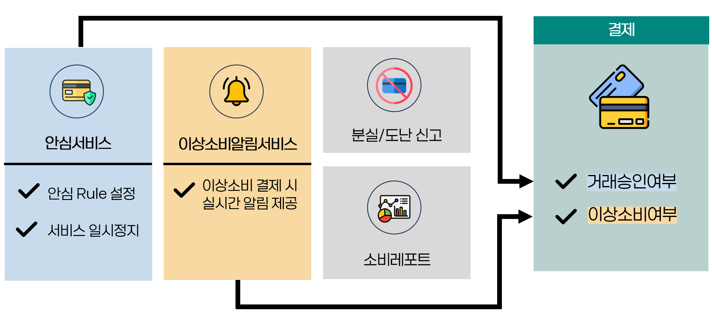 <br/>

#### 결제 흐름도
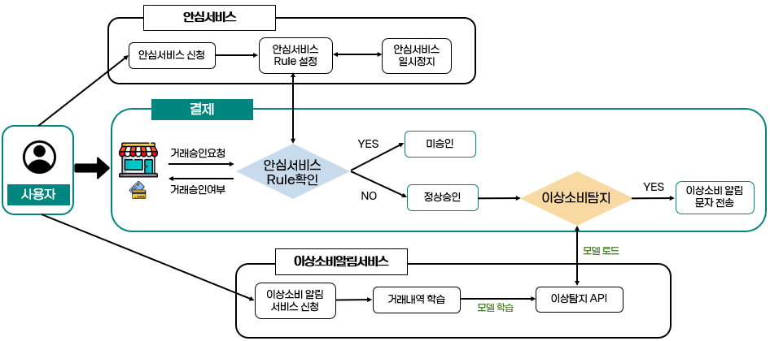 <br/>


### 2-2. 관리자

• 군집분석 :<br/>
  하나카드 전체 사용자 소비데이터 확인.<br/>
  군집 별 특징 확인<br/><br/>
  
• 이메일 전송 :<br/>
  군집분석의 결과를 활용하여 군집 변 안심서비스 추천 메일 전송.<br/><br/>

• 이상소비알림서비스 관리 :<br/>
이상소비내역 확률분포 시각화 및 서비스 사용자, 이상소비내역 관리.<br/><br/>

• 안심서비스 관리 :<br/>
안심서비스 사용자 및 미승인 내역 관리.<br/><br/>

• 분실/도난 신고 관리 :<br/>
분실카드 사유별로 확인 가능.<br/><br/>

• 결제로그 관리 :<br/>
일자별 카드별 결제로그 확인 가능.<br/><br/>
  
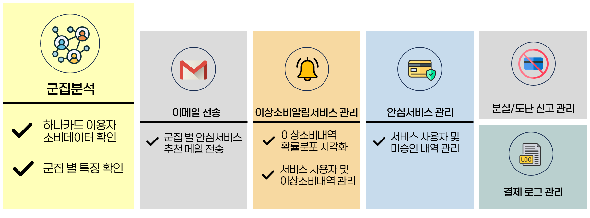 <br/>


# 3. 프로젝트 구성도

### 3-1. 시스템 아키텍처

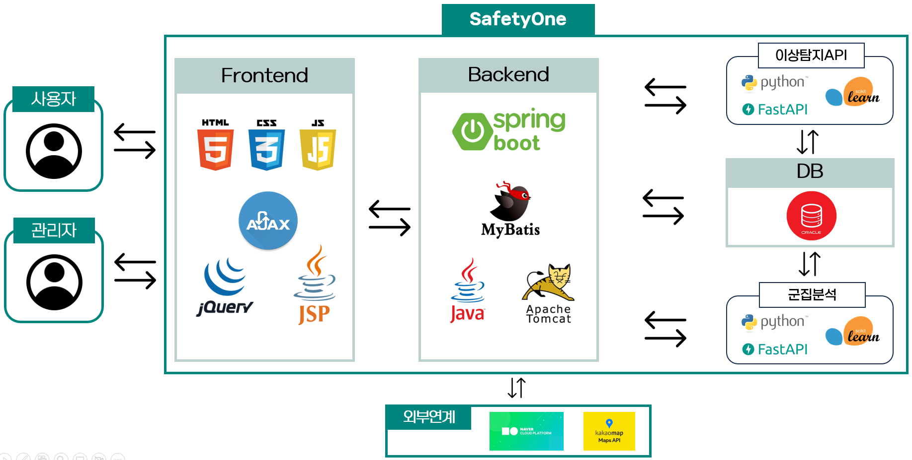 <br/>


### 3-2. ERD

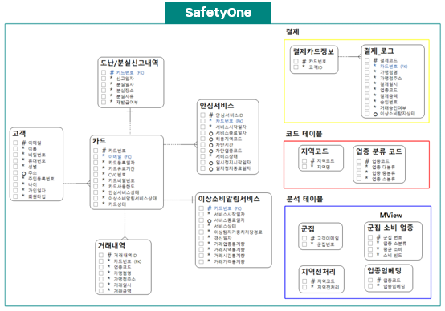 <br/>


# 4. 적용기술

• Spring MVC 기반 웹 어플리케이션 제작<br/>
• Python Faker Library 활용한 가상의 대용량 데이터 생성<br/>
• Python Scikit-Learn K-means clustering을 활용한 군집분석<br/>
• Python Scikit-Learn GMM 모델을 활용한 이상탐지 API 개발<br/>
• Simple & Easy Notification Service를 통한 SMS 본인인증, 알림메시지 전송<br/>
• Kakao Map API를 활용하여 오프라인 결제 가맹점명 검색<br/>
• Java Mail Sender를 활용한 안심서비스 추천 메일 전송<br/>
• M-VIEW, INDEX를 활용한 성능개선<br/>

### 대용량 데이터 생성
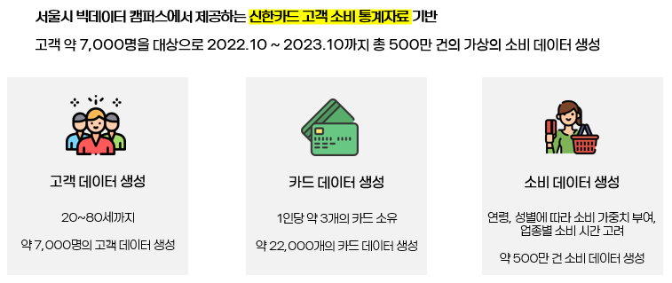 <br/>

### 성능개선
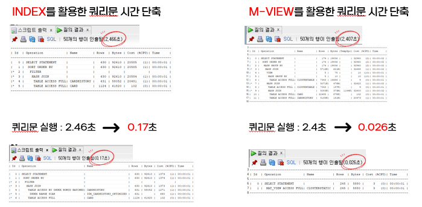 <br/>

### 적용된 특화 기술
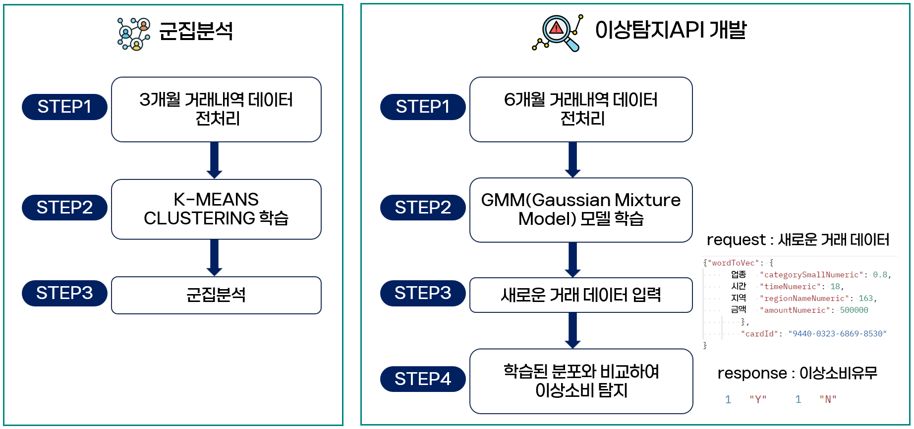 <br/>

### 그 외 적용 기술
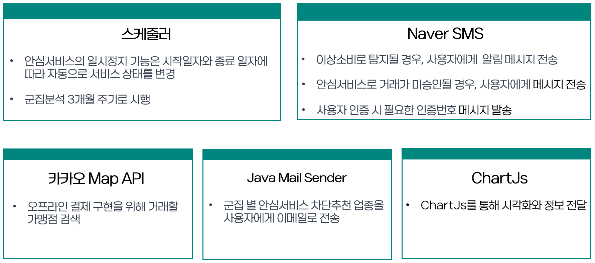 <br/></br>


# 5. 보완사항 및 느낀 점

### 5-1. 보완사항
• 실시간 다량의 트랜잭션 처리의 아쉬움 :<br/>
  다량의 결제 데이터 처리시 과부하 발생 우려.<br/><br/>

• 실제 데이터의 사용 :<br/>
  실제 데이터를 사용함으로써 정확한 인사이트 도출.<br/><br/>


### 5-2. 느낀 점
데이터의 정확성에만 초점을 맞췄다면 이번기회에 대용량 데이터를 처리하면서 쿼리의 최적화나 성능 개선 등 데이터를 다른 각도에서 바라볼 수 있었습니다.


## 발표 ppt

[발표자료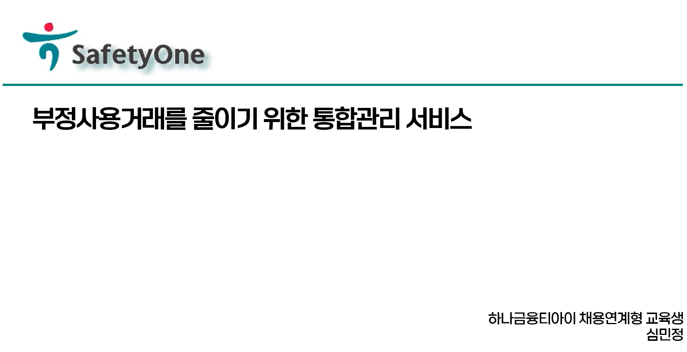](/SafetyOne_심민정.pdf) <br/>


## 시연 동영상


# 4. 본인 소개

| 구분                           | 내용                                                                                          | 비고                                       |
| --------------------------   | --------------------------------------------------------------------------------------------- | ------------------------------------------ |
| 이름                          | 심민정                                                                                       |         |
| 연락처                         | pooh5045@naver.com                                                                             |      
| 학력사항                        | 광운대학교 정보융합학부 데이터사이언스전공                                                        | 2022.02                               |
| Frontend skill               | HTML, CSS, Javascript                                                                         |                                            |
| Backend skill                | Java,Python, SpringBoot, Oracle                                                                          |              
| 자격증                         | 데이터분석 전문가(ADP) 필기                                                                  | 2022. 02. 26                        |
|                          | 빅데이터분석기사                                                                  | 2021. 12. 31                           |
|                       | 정보처리기사                                                             | 2020. 12. 31                            |
|                         | SQL 개발자(SQLD)                                                             | 2020. 09 .25                           |
|                     | 데이터분석 준전문가(ADsP)                                                                 | 2020. 08. 29                             |
|                    | 리눅스마스터 2급                                                                  | 2019. 10. 11                            |
| 교육활동                       | 하나금융티아이 채용전환형 교육 1200시간( 한국폴리텍대학교 광명융합기술교육원 - 데이터분석과 ) | 2023.03.02 ~ 2023.10.20 (1200시간)         |       
| 경력사항                       |코오롱베니트 (인턴)                                                | 2022.07 ~ 2022.09 (3개월)          |
|                        |슈어소프트테크 (인턴)                                                | 2022.03 ~ 2022.06 (4개월)          |
